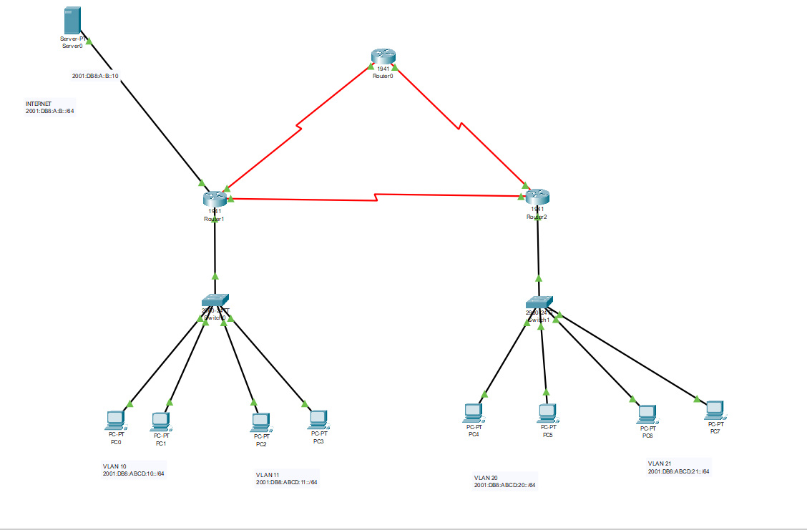

# IPv6, VLANs, and Fault-Tolerant Routing Lab

This repository contains a complex, multi-site network topology built in Cisco Packet Tracer. The objective was to build a robust network based on a strict set of technical requirements.

The project's focus is on implementing a pure **IPv6 network**, segmented with **VLANs**, and made fully redundant using the **RIPng** dynamic routing protocol.

---

### Topology

This is the logical topology of the implemented network, showing all devices, VLANs, and IPv6 address spaces.



---

### Core Skills & Technologies

This lab demonstrates proficiency in the following key networking areas:

* **IPv6 Addressing:** The entire network is built on IPv6 (`2001:DB8::/64` prefix), including all routers, servers, and client PCs.
* **VLAN Segmentation:** The access layer is segmented into four distinct VLANs (VLAN 10, 11, 20, 21) to isolate traffic between departments.
* **Inter-VLAN Routing:** Implemented "Router-on-a-Stick" on routers R1 and R2 to allow communication between the different VLANs.
* **Dynamic Routing (RIPng):** The **RIPng** protocol is used to dynamically share routing information between R1 and R2.
* **Fault Tolerance (Redundancy):** The network was designed to be fault-tolerant. As shown in the topology, there are multiple WAN links. The network remains fully functional and automatically re-routes traffic if one of the primary WAN links fails.
* **Default Route Redistribution:** The routers are configured to learn a default route (to the "Internet") and redistribute it via RIPng to all client PCs, providing them with external network access.

---

### Project Objectives & Features

This project was built to meet the following technical goals:

* **[✓] VLAN Connectivity:** PCs within the same VLAN (e.g., VLAN 10) can communicate.
* **[✓] Inter-VLAN Connectivity:** PCs in different VLANs on the same switch (e.g., VLAN 10 and VLAN 11) can communicate.
* **[✓] Inter-Site Connectivity:** PCs on the "left" network (VLAN 10/11) can communicate with PCs on the "right" network (VLAN 20/21) and vice-versa.
* **[✓] Server Access:** All PCs on all VLANs have full access to the central Server (`2001:DB8:ABE:10::/64`).
* **[✓] Internet Access:** All PCs have access to the "Internet" via a redistributed default route.
* **[✓] Fault Tolerance:** The network correctly handles a link failure and continues to route traffic.

---

### Key Configuration Examples

Here are some representative snippets of the configuration used in this project.

#### 1. Router-on-a-Stick (Inter-VLAN Routing)

Configuration for a router's sub-interfaces to handle tagged VLAN traffic.

```cisco
! On Router R1
!
interface GigabitEthernet0/0.10
 encapsulation dot1Q 10
 ipv6 address 2001:DB8:ABCD:10::1/64
!
interface GigabitEthernet0/0.11
 encapsulation dot1Q 11
 ipv6 address 2001:DB8:ABCD:11::1/64
!
```
2. RIPng (Dynamic IPv6 Routing)
Enabling RIPng globally and on specific interfaces.

```Cisco CLI

! Global configuration
!
ipv6 unicast-routing
!
ipv6 router rip MY_RIP_PROCESS
!
! Interface configuration (e.g., on WAN link)
!
interface Serial0/1/0
 ipv6 address 2001:DB8:ABCD:12::1/64
 ipv6 rip MY_RIP_PROCESS enable
```
3. Default Route Redistribution
Injecting a default route into the RIPng process to provide internet access to all devices.

```Cisco CLI

! On the router connected to the "Internet" (R1)
!
! Create a static default route
ipv6 route ::/0 2001:DB8:A:B::1
!
! Redistribute it in the RIPng process
ipv6 router rip MY_RIP_PROCESS
 default-information originate
```
